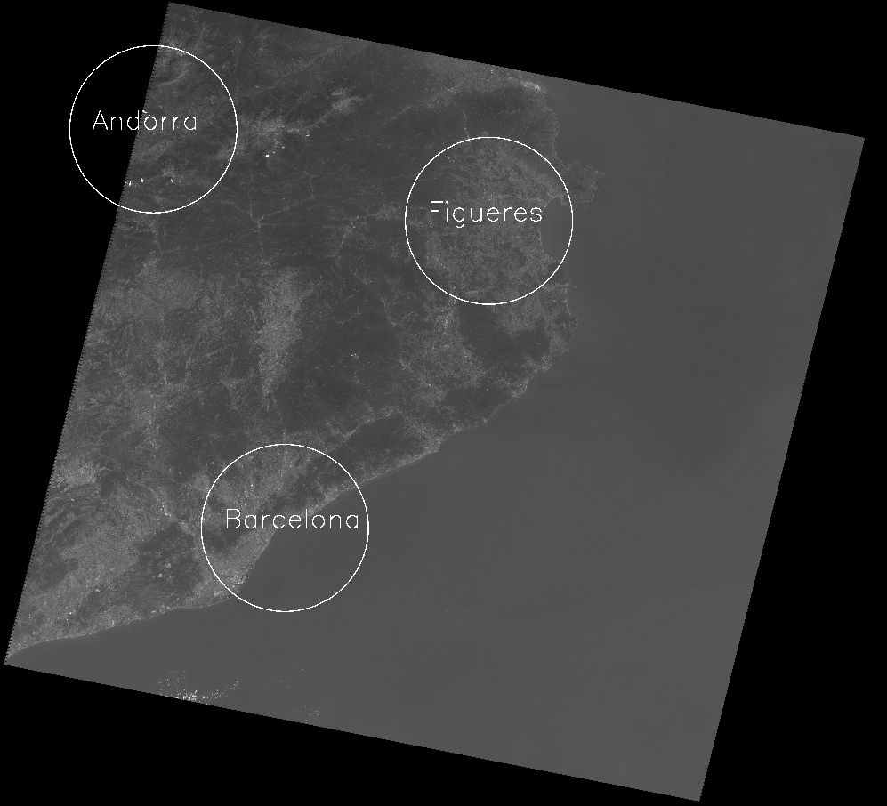

# Лабораторная работа №1
Выполнил студент группы м30-312Б Корсаков А.

### Цель работы: 
обозначить на снимке со спутника города с заданными координатами по долготе и широте.

### Выполнение:
1. Выполняется парсинг функцией getFromMTL из модуля module1.py дня нахождения значения углов снимка (в градусах).
2. Рассчитываются дельты по долготе и широте.
3. Находим город при помощи формулы деления отрезка в данном отношении. Для этого рассчитываем коэффиценты для каждого отрезка :(UL,UR) и (LL,UL). Далее функция get_p из модуля module1.py по формуле деления отрезка в данном отношении находит искомую точку для каждого из отрезков.

### Вывод программы: 

